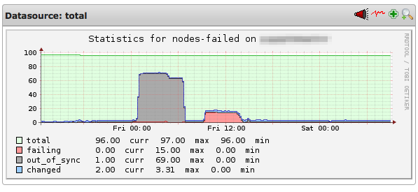

opstools/nagios/check_foreman
=============================

* check_foreman.pl - Nagios Plugin (Perl Script)
* check_foreman.php - PNP4Nagios template

This Nagios Plugin is made for a Puppet-controlled environment.
It requires that The Foreman is also installed and configured
See:
	http://puppetlabs.com/
	http://theforeman.org/

The plugin works by accessing the Foreman API, and check for puppet clients which are either
a) Failing
b) Out of date (no recent reports)

It also reports the total number of nodes that have been checked

Installation & Configuration
----------------------------

Create a user in The Foreman for the plugin to use. eg.
	username: nagios
	password: secret

This user only requires the permissions 'Viewer' and 'View hosts'

(optional) In Foreman, create a 'Host Group' named 'unmanaged' (or something similar)

Copy the plugin to:
	nagios-server:/usr/lib/nagios/plugins/check_foreman.pl

Add the following to your Nagios configuration

In resource.cfg:
	$USER3$=secret

In the usual *.cfg files:
	define command {
		command_name    check_foreman
		command_line    /usr/lib/nagios/plugins/check_foreman.pl -H $HOSTNAME$ $ARG1$
	}

	define service {
		use				generic-service
		host_name			foreman-server
		service_description		puppet-nodes
		check_command			check_foreman!-p 3000 -l nagios -a $USER3$ -G unmanaged -o 60
	}

	( and a host definition for 'foreman-server' )

Set the port if required. It will be the same as port used for the Foreman web-interface.

Set the optional '-G groupname' to exclude troublesome servers from this check.

For SSL, add the options -S and -k

PNP4Nagios
----------
Copy the file check_foreman.php to your PNP4Nagios templates directory

Other Requirements
------------------

Perl packages required by this plugin:

	LWP:  libwww-perl (deb)  or  perl-libwww-perl (rpm)
	JSON: libjson-perl (deb) or perl-json (rpm)

ScreenShots
-----------

